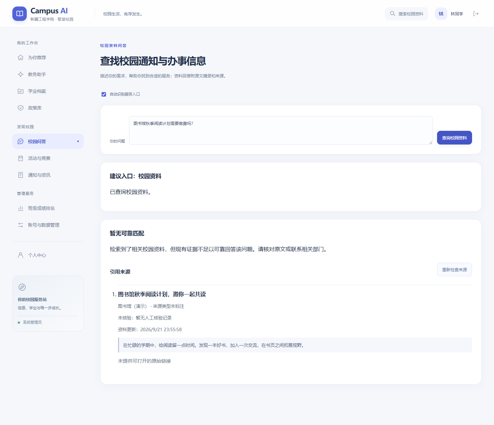

# Jev 接入与验证

## 配置

官方依赖：`typesafe-sdk>=0.7.1,<0.8`，具体版本由 `uv.lock` 固定。

后端从进程环境变量读取 `TYPESAFE_API_KEY`。Windows 用户环境变量已配置时，无需把密钥复制到 `.env`；旧终端与已启动后端可能需要重启才能继承新变量。前端不读取 API key。

`.env.example` 提供非敏感配置：

| 配置 | 默认值 | 作用 |
| --- | --- | --- |
| JEV_ENABLED | false | 是否允许决策模块使用 Jev |
| JEV_MODEL | jev-latest | Jev 模型别名 |
| JEV_TIMEOUT_SECONDS | 12 | SDK HTTP 操作超时秒数，限制在 1–30 秒 |
| JEV_ROUTER_MIN_CONFIDENCE | 0.70 | 路由置信度门槛 |
| JEV_EVIDENCE_MIN_PROBABILITY | 0.55 | 低于此值标记证据不足 |
| JEV_EVIDENCE_ALLOW_PROBABILITY | 0.80 | 达到此值才允许标记证据充分 |

SDK 自动重试关闭。路由和证据检查是顺序步骤，每步分别适用超时；该设置不是整个 HTTP 请求的总时限。阈值是初始工程配置，应根据标注数据校准，不能作为论文准确率。

## 决策模块

`app/jev.py` 统一提供：

- `route_question(question)`：Choice 路由到校园资料、奖学金、推荐、学业档案或其他；低置信度回退到校园资料入口。验证路由枚举、分布完整性及数值范围。
- `evidence_sufficient(question, sources)`：Noul 判断摘录是否直接支持回答；最多 5 条资料，仅保留标题、摘录、来源类型与核验标记。
- 无配置、API 异常或非法响应时返回明确的 fallback，不记录异常正文、密钥、问题或资料正文。
- 证据检查未执行时 `probability=null`、`sufficient=null`、`status=unchecked`，不会伪造 100% 可信度；无来源在本地直接返回 `no_sources`。
- 0.55–0.80 为 uncertain，低于 0.55 为 insufficient；只有达到 0.80 才是 sufficient。

Jev 不生成校园事实，不计算成绩，不授予权限，也不直接判断奖学金资格。接口不接收学业档案或用户账号对象。用户自己输入的问题和校园资料摘录可能含有个人或非公开信息，因此实际业务外发需明确授权。

## 独立连通性验证

```powershell
uv run python scripts/test_jev_live.py --run
```

脚本只使用内置虚构问题与图书馆通知，不加载应用数据库。会发起 3 次 API 请求，可能产生用量；不带 `--run` 不会执行。退出码 0 代表三个样例符合预期，1 代表发生降级，2 代表模型结果未达到样例期望。

本次实测：奖学金路由为 scholarship（confidence=1.0）；明确开放时间的证据概率 0.96；无罚款依据的证据概率 0.02。以上仅为少量连通性样例结果，不代表真实校园业务准确率。

## 自动测试

```powershell
uv run python -m pytest -q -p no:cacheprovider
```

普通 pytest 清空 Jev key 并默认关闭开关，同时阻断真实 SDK 请求；测试通过 mock 注入结果，覆盖缺失密钥、关闭、异常、低置信度、边界概率、非法模型响应、数据字段裁剪和日志保密。

## 业务接入与使用

本轮完成意图路由和 RAG 证据检查，未实施后续的资料分类、初评复核概率功能。本机 `.env` 已设 `JEV_ENABLED=true`，真实密钥仍保留在用户环境变量中。重启后端后生效；其他部署默认关闭，需按需要显式启用。

1. 打开“校园问答”，保留“自动识别服务入口”勾选，输入问题。
2. 奖学金问题会显示“进入教务助手”。点击后问题带入新评估草稿，须确认年度再发送；不会自动提交个人资格评估。
3. 校园资料问题先做本地检索与权限/时效过滤，再由 Jev 检查证据。只有充分时展示资料回答；不足或不确定时暂不下结论，仍可阅读原文摘录。
4. 可关闭自动分流，直接查资料；这只关闭路由，启用状态下证据检查仍执行。完整停用外部调用需设 `JEV_ENABLED=false` 并重启后端。
5. Jev 关闭、缺失密钥或出错时回退为本地摘录，页面明确显示“未完成语义证据检查”。来源复查验证访问范围和资料版本，复用原检查结果，不额外调用 Jev。

后端调用链：

```text
POST /assistant/ask（需登录）
  -> Jev Choice 意图判断
     -> campus_qa: 原有 RAG 检索 -> 权限/时效过滤 -> Jev Noul -> 回答或证据不足
     -> scholarship / academic / recommendation / other: 返回导航建议
POST /rag/ask（需登录）
  -> 原有 RAG 检索 -> 权限/时效过滤 -> Jev Noul -> 回答或证据不足
GET /rag/sources/{answer_id}
  -> 用户、权限、有效期与资料版本复查 -> 原回答及原证据检查结果
```

新增 `/assistant/ask` 返回 `decision`、`target_page`、`message`、`result`；`result` 仅在校园资料路径包含 RAG 结果。`decision` 包含路由、置信度、概率分布、来源和降级原因；不在用户页面把置信度展示为答案正确率。`/rag/ask` 新增 `evidence` 和 `evidence_probability`，保持原字段兼容；fallback 的 `grounded=true` 仅表示有本地摘录，不等于 Jev 已验证，应同时查看 `evidence.status`。

发送给 TypeSafe/Jev 的业务数据范围为用户的问题和最多 5 条当前有权查看的校园资料摘录，字段限制为 title、snippet、source_type、verification_status；代码不附加账号、学业档案、成绩单或认证令牌。权限检查、推荐排序、DeepSeek 抽取、确定性资格与排名计算仍由原模块负责。

## 本轮验收

- 全量 84 项 pytest 通过（其中新增 42 项），普通测试禁止真实 TypeSafe 请求。
- 前端生产构建通过。
- 真实 API 虚构样例：路由正确，充分证据 0.96、不足证据 0.02。
- 浏览器独立演示环境：奖学金问题完整带入教务助手草稿；阅读活动是否收费的问题检索到 1 条演示资料，但原文没有费用信息，证据概率 0.04，页面暂不作答并保留摘录；390 像素手机页面无横向溢出，无页面脚本异常。
- 修复既有重复上传测试的偶发失败：复用同一份 XLSX 字节，避免重新生成文件时 ZIP 时间戳变化。生产去重逻辑未修改。



## 官方参考

- [Python SDK](https://docs.typesafe.ai/sdk/python)
- [Choice](https://docs.typesafe.ai/primitives/choice)
- [Noul](https://docs.typesafe.ai/primitives/noul)
- [同步客户端与超时](https://docs.typesafe.ai/sdk/python/api/clients/sync)
- [函数路由示例](https://docs.typesafe.ai/cookbooks/function_calling)
- [引用检查示例](https://docs.typesafe.ai/cookbooks/citation_check)
