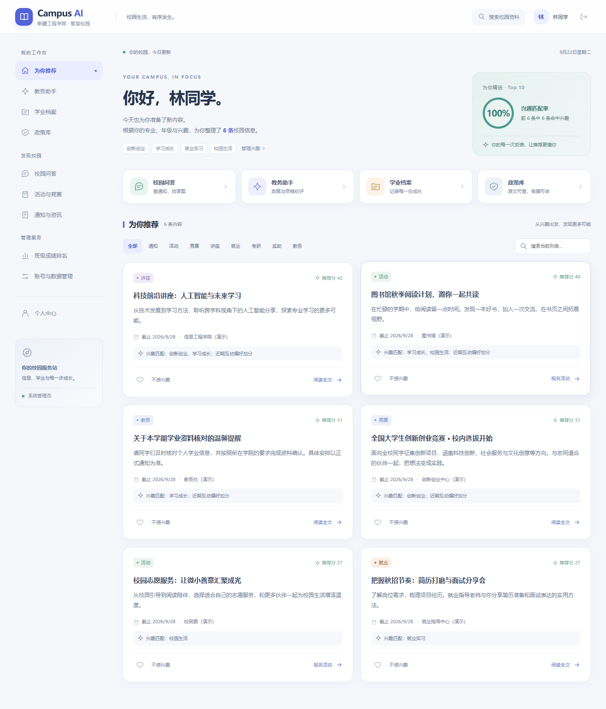
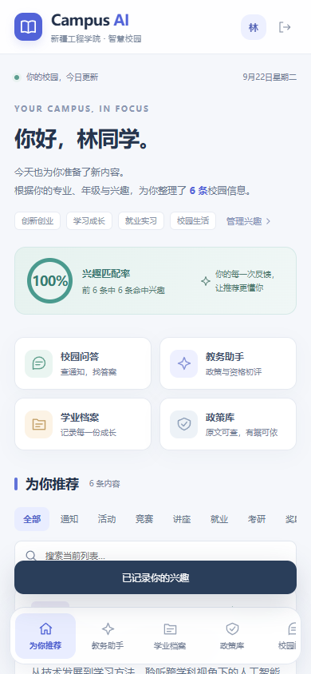
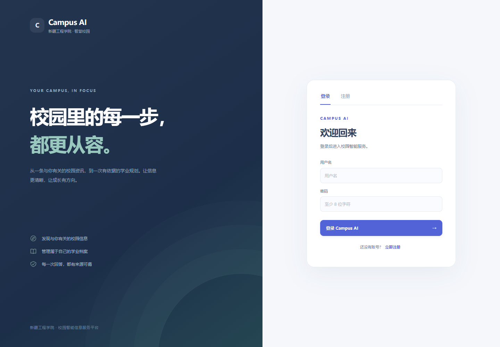

# Campus AI 前端美化与验收说明

更新日期：2026-09-22。

## 设计与页面变化

界面采用浅色校园门户风格：深蓝文字、靛蓝主操作、青绿色匹配指标。统一卡片圆角、页面留白、图标、表单、表格与交互反馈。

- 登录与注册：重排品牌介绍、账号表单和移动端布局。
- 全局导航：桌面端按工作台、校园发现与管理服务分组；手机端使用可横向滑动的底部导航，保留文字标签与角色对应入口。
- 首页：增加校园问答、教务助手、学业档案、政策库四个快捷入口；兴趣匹配圆环读取后端实际指标，样本数为零时显示暂无样本。
- 推荐卡片：突出分类、标题、摘要、日期、来源、推荐原因及操作。标题可以打开全文；活动卡片保留报名入口。
- 服务页面：统一问答、学业档案、政策库、班级排名和账号管理的表单及信息层级；限制文件选择控件宽度，避免窄屏溢出。
- 可访问性细节：添加可见键盘焦点、分类选择状态、导航当前页状态、搜索和图标按钮标签；支持系统减少动态效果设置。

## 界面预览

以下截图使用独立临时数据库与演示账号生成；校园内容均为演示数据，不是学校正式通知。截图中的 100% 为该演示数据集的实际兴趣命中比例，不代表真实推荐准确率或实验结果。

### 桌面首页



### 手机首页



### 登录页



## 实现位置

| 文件 | 职责 |
| --- | --- |
| `frontend/src/design.css` | 配色、布局、组件视觉与响应式覆盖样式 |
| `frontend/src/components/AppIcon.vue` | 本地 SVG 图标组件，无外部图标服务依赖 |
| `frontend/src/components/AppHeader.vue` | 品牌、问答入口、个人中心和退出 |
| `frontend/src/components/Sidebar.vue` | 分组导航及角色入口 |
| `frontend/src/components/RecommendationCard.vue` | 推荐信息与操作层级 |
| `frontend/src/App.vue` | 登录介绍、首页快捷入口和匹配指标 |
| `frontend/src/main.js` | 先载入基础样式，再载入视觉样式 |

## 已执行验收

1. `npm --prefix frontend run build`：通过，生成生产资源。
2. `.venv\Scripts\python.exe -m pytest -q`：42 项通过；存在 2 条测试依赖弃用提示。
3. 使用本机 Chrome / Playwright，在独立临时数据库中检查登录、关键词空结果、恢复全部、全文弹窗、校园问答、管理页面与个人中心；没有捕获到页面运行异常。
4. 首页在 320、390、768、1024 像素宽度下，文档宽度均等于视口宽度。
5. 教务助手、学业档案、政策库、校园问答、班级排名、账号管理在 320 像素宽度下均未出现页面横向溢出；管理账号的 10 个导航入口均可通过导航滚动访问。
6. 人工检查桌面首页、手机首页、登录、管理表单和手机个人中心截图。

本轮浏览器验收覆盖的是界面布局和上述交互，没有用真实材料执行 OCR、政策审核或模型调用，也未覆盖所有浏览器、辅助技术和长内容组合。

## 启动查看

按项目 README 启动后端，再运行：

```powershell
npm --prefix frontend run dev
```

默认后端地址为 `http://127.0.0.1:8000`；如使用其他端口，通过 `VITE_API_BASE_URL` 配置。已有开发服务通常会自动更新，生产运行需使用本轮重新构建的前端资源。
