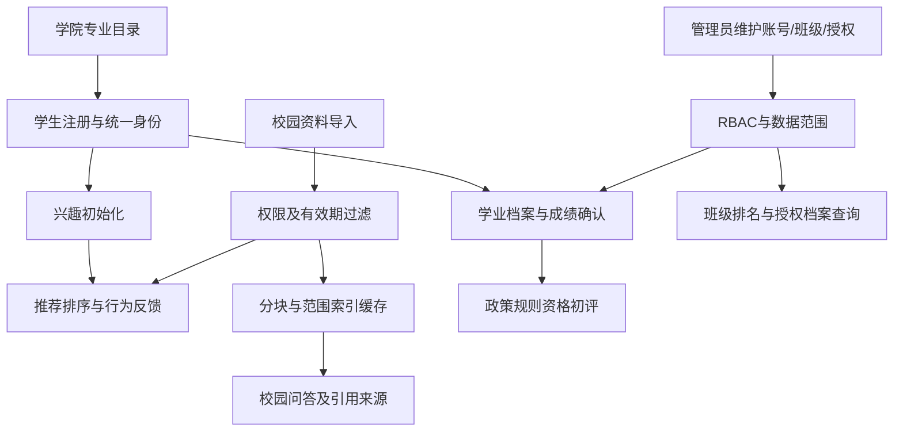

# 新疆工程学院 Campus AI：系统优化总报告与验收指南

版本：2026-09-21；对应仓库：someh7162-ui/GraduationProject。

系统定位：**面向新疆工程学院的校园智能信息服务系统设计与实现**。覆盖统一账户、个性化推荐、校园资料问答、个人学业档案、班级成绩排名与奖学金资格初评。

本报告是当前代码的交付说明。Repaire1Demo 保存原始修改建议与参考补丁；旧设计文档、旧 Word 文件和早期阶段记录作为历史材料保留，若有冲突，以本报告、第三/第四阶段说明及当前代码为准。

## 1. 本轮结论

六阶段涉及的软件工程改造已落实并通过本地回归。42 项自动化测试通过，前端生产构建通过，三方案离线评估流程可复现。已新增 GitHub Actions 检查配置。

不能由软件自动完成的部分仍需实际证据：学校资料的人工核验、真实用户实验、真实 MySQL 部署验收和最终论文实测结论。本次没有伪造用户反馈、政策核验日期或真实推荐提升率。

## 2. 修改清单逐项对应

| 原建议 | 实施结果 |
| --- | --- |
| P0 学院专业数据源、后端对应关系校验 | app/catalog 提供统一目录与两个查询接口，拒绝不匹配学院专业 |
| P0 注册学院→专业联动 | 前端使用后端目录，以编码选择；名称与编码均入库 |
| P0 禁止自行注册辅导员/管理员 | 公共注册只接受 student；工作人员由系统管理员创建 |
| P0 首次登录引导与推荐首页 | 未初始化进入兴趣选择，完成后进入推荐首页，刷新登录态保持规则 |
| P1 学院、专业稳定编码 | college_code、major_code；旧数据仅对可识别身份进行回填 |
| P1 行为分权与真实指标 | 六种行为权重、30 天半衰期、重复抑制、负反馈、真实 Top 10 兴趣覆盖 |
| P1 推荐与 RAG 权限统一 | content_visible + content_active；资讯列表、详情、行为与来源复查共用 |
| P1 统一 content_type | 8 种标准类型，后端 catalog 向前端提供同一份字典；旧类型迁移与导入兼容 |
| P1 学业身份关联 | 个人档案与助手使用账户身份，覆盖旧档案中不一致身份；用户不可自改学院、专业、年级、班级事实 |
| P1 OCR 辅助识别与确认 | 预览、警告、置信度、人工修改与明确确认；排名以教务正式数据为准 |
| P1 RBAC + 数据范围 | 管理员全局；学院管理员本学院；辅导员负责班级；学生本人 |
| P1 同步测试与系统名称 | 测试数据换为目录内身份；README、API 标题、交付文档统一 Campus AI 定位 |
| P2 TF-IDF 缓存索引 | 缓存 vectorizer/矩阵；全文指纹失效、权限范围隔离、LRU 与并发锁 |
| P2 推荐离线评估 | A/B/C 三方案及 Precision、Recall、Hit Rate、NDCG；时间切分防泄漏 |
| P2 来源可信度、核验时间 | 来源类型、发布单位、last_verified_at、effective_from/to；缺记录明确未核验 |
| P2 JWT_SECRET 强制配置 | 至少 32 字符；无默认密钥；本地初始化脚本生成随机密钥 |
| P2 CORS 限制 | 默认仅 localhost/127.0.0.1:5173；拒绝通配符配置 |
| P2 数据基础规范 | 学院专业统一编码目录、内容分类枚举、独立班级表、授权审计表；保留轻量 JSON 业务快照 |
| P2 安全章节、实验章节 | 本报告第 6–8 节及第三阶段文档可作为论文技术章节基础 |

## 3. 六阶段完成情况

1. 学院与专业：统一目录、归属校验、前端联动和存量数据兼容。
2. 账号与引导：学生自助注册、后台工作人员创建、身份权限管理、兴趣引导。
3. 推荐：行为权重、可解释排序、真实指标与离线评估。详见《第三阶段_推荐算法优化与验证》。
4. RAG：统一权限、缓存、内容变更失效、历史来源重新授权、来源元数据与校园问答页面。详见《第四阶段_RAG权限缓存与来源验证》。
5. 学业：账户身份作为唯一口径；学生本人数据隔离；班级目录与辅导员授权；学院范围档案查看；审计。
6. 工程交付：测试、构建、持续集成配置、README、总报告、实验口径和演示步骤。

## 4. 结构与数据流



核心模块：

- `app/campus.py`：账户、内容、推荐与 RAG 接口；兼容原数据表。
- `app/catalog/`：新疆工程学院学院专业目录与公共查询。
- `app/recommendation.py`：在线与离线共用的确定性排序。
- `app/rag_index.py`：内容指纹、分块、权限范围索引和混合检索。
- `app/source_metadata.py`：来源元数据、时间校验、可打开来源链接。
- `app/access.py`、`app/admin.py`：班级目录、数据范围、管理授权与审计。
- `app/academic/`：档案、政策版本、可恢复评估会话、证据与成绩排名。

数据库变化：users 增加学院专业编码、class_name、managed_classes；contents 增加来源与有效期字段；campus_classes 保存唯一班级名称与学院归属；access_audit 保存授权和管理档案访问记录。旧表字段升级由启动执行，原业务记录保留。班级归属只由管理员分配，学生不能通过填报档案把自己加入某个班级。

不额外引入 Redis 集群、向量数据库或微服务；对于当前毕业设计规模，统一目录和明确权限优先于大规模重构。

## 5. 账号与权限操作

首次配置：先正常注册一个学生账号，然后由本地部署人员执行：

```powershell
.\.venv\Scripts\python.exe scripts/set_academic_admin.py 用户名
```

刷新登录态后进入“账号与数据管理”：

1. 登记班级与学院。
2. 创建教师、辅导员、学院管理员或其他系统管理员账号。
3. 给学生分配与注册学院一致的班级。
4. 给辅导员勾选负责班级；给学院管理员指定学院。
5. 管理人员只能查看其负责范围的学生档案及排名。
6. 取消负责班级后，新请求立即失去权限；无需等 JWT 到期。

| 角色 | 个人功能 | 学生档案 / 班级排名 | 账号与政策管理 |
| --- | --- | --- | --- |
| student | 个人推荐、问答、档案与初评 | 仅本人档案；不能读班级排名 | 无 |
| teacher | 个人功能，可重建 RAG 索引 | 不授予全院/全班成绩读取 | 无 |
| counselor | 个人功能 | 负责班级 | 无 |
| academic_admin | 个人功能 | 本学院 | 无全局账号/政策写权限 |
| admin | 个人功能 | 全局 | 全局账号、班级、授权和政策管理 |

政策发布保持系统管理员权限，避免学院管理员未经额外政策范围设计直接发布全校政策。普通用户不能更改自己的角色。后台不允许管理员通过普通授权接口修改自身权限，降低自锁风险。

学生成绩文件继续按所有者访问；管理人员的授权档案查询不开放原始文件下载。OCR 是辅助输入，必须人工核对并确认。

## 6. 安全设计与论文说明

身份认证使用带有效期的 JWT；服务端每次按账户 ID 查询当前角色和范围，撤销授权立即生效。密码使用随机盐 PBKDF2 哈希保存，管理审计不记录密码。JWT 密钥不得使用默认值，.env 和私有上传目录不提交版本库。

身份目录检查防止虚构学院与错配专业。档案中的身份信息以账户为准；填报或导入的冲突身份会被拒绝，旧档案的身份字段不会覆盖账户。身份来源与成绩材料证据分别保留。

数据访问采用角色与范围相结合：学生个人文件按所有者隔离，辅导员范围来自管理员授权的班级目录，学院管理员范围来自账户学院编码。班级排名读取、列表、上传和确认均执行范围检查。

内容检索按用户可见集建立索引，限制隐藏内容参与排序统计。旧答案来源会检查当前权限、有效期与资料版本，减少缓存造成的信息泄漏。对无可靠命中的问题拒答，不以缺失信息推断政策资格。

CORS 仅允许显式配置的前端源。来源链接只允许 HTTP/HTTPS；UI 使用 Vue 文本插值展示资料，不执行资料中的脚本。上传有大小和格式限制。教务规则结果以确定性代码计算，模型提议仍需结构化校验和人工确认。

局限：尚未实现 MFA、集中审计平台、分布式缓存或大型并发压测；生产公网部署还应配置 HTTPS、备份、入口限流及合适的账户策略。这里描述的是实际已实现边界，不是生产安全认证。

## 7. 推荐实验设计与现有结果

A：仅兴趣；B：兴趣 + 身份；C：完整混合推荐。三组使用同一候选权限/时效约束，不能通过给基线更多受限资料来制造提升。

实验数据由 cutoff 时点用户与资料快照、cutoff 之前的历史行为、独立相关性标签组成。相关标签需来自人工标注或后续真实反馈；不能直接由本算法分数反推。

运行：

```powershell
.\.venv\Scripts\python.exe scripts/evaluate_recommendations.py data/recommendation_eval_sample.json --output docs/recommendation_eval_sample_results.json
```

当前样例为明确标注的合成数据（3 个用户、12 条内容），结果用于确认计算流程：

| 方案 | Precision@5 | Recall@5 | Hit Rate@5 | NDCG@5 |
| --- | ---: | ---: | ---: | ---: |
| A | 0.466667 | 1.0 | 1.0 | 0.795618 |
| B | 0.466667 | 1.0 | 1.0 | 0.871049 |
| C | 0.466667 | 1.0 | 1.0 | 0.897809 |

论文正式实验应补充真实样本量、标注规则、时间窗口、用户划分和误差分析。在取得这些资料前，只能写“实现并验证评估流程”，不能写“已证明真实推荐性能提升”。RAG 真实问题集的引用准确率与拒答准确率同样需要独立标注。

## 8. 测试与验收证据

本地环境执行：

```powershell
.\.venv\Scripts\python.exe -m pytest -q -p no:cacheprovider
cd frontend
npm run build
```

结果：42 项测试通过，2 条来自 Starlette/httpx 的弃用提示；Vue/Vite 生产构建通过。新增 GitHub Actions 自动运行测试、合成评估和前端构建，远程运行结果以 GitHub Actions 页面为准。

主要覆盖：真实学院专业注册、角色拒绝、首次兴趣流程、行为权重与时间衰减、重复反馈、跨用户反馈隔离、指标计算、推荐评价公式、检索缓存复用、并发训练、缓存更新、跨用户来源访问、正文同 ID 更新、过期与撤权、来源导入、旧数据库字段升级、工作人员创建、跨学院/跨班级访问、撤权后再次读取、身份伪造拒绝、CORS 与密钥配置、统一资讯查询。

测试使用隔离的临时 SQLite，不以实际学生数据运行，也不向外部模型发送数据。真实 MySQL 尚未在本轮连接验收；不把 SQLite 测试通过等同于线上 MySQL 已验证。

## 9. 启动、升级与演示

推荐本地 SQLite 启动：

```powershell
uv sync --extra dev
uv run python scripts/init_local_env.py
uv run uvicorn app.main:app --host 127.0.0.1 --port 8000
```

另开终端：

```powershell
cd frontend
npm ci
npm run dev
```

访问 `http://127.0.0.1:5173`。已有 .env 会被保留；初始化脚本仅在 JWT 密钥缺失或过短时修复密钥，不打印密钥。本轮本机密钥已修复，重启后旧会话需重新登录。实际业务库字段会在后端下一次启动时升级；升级前可按部署习惯备份数据库与 .private 上传文件。

MySQL：按 .env.example 显式配置真实数据库连接，再执行现有初始化流程。CORS_ORIGINS 中列出实际前端源，使用逗号分隔。RAG 的进程内缓存适用于单进程演示，多 worker 下历史答案缓存不共享。

建议答辩演示顺序：

1. 注册学生，展示学院专业联动和非法身份拒绝。
2. 首次登录选兴趣，展示真实匹配率。
3. 收藏或选择不感兴趣，展示推荐分与解释变化。
4. 进入校园资讯/活动，查看完整原文。
5. 校园问答，查看引用、核验状态；无关问题展示拒答。
6. 管理员登记班级与授权，切换辅导员展示只能访问负责班级。
7. 导入成绩、人工确认；按真实政策建立资格初评，未知条件保持待补充。
8. 展示测试结果和离线评估，明确合成实验与真实效果的区别。

## 10. 后续实际资料事项

- 校方学院专业目录调整需维护目录来源并复核；代码中的目录不能替代学校最新公告。
- 旧账号中无法自动识别的学院专业不强行猜测，需要人工核对。
- 历史排名记录如班级未登记，辅导员默认不可访问；管理员登记相同班级名称并授权后才开放。
- 来源核验时间由实际维护人员填写，不从导入日期自动生成。
- 真实论文实验与最终答辩材料需结合实际采集证据完成；本报告提供当前软件实现、安全论证、实验方案与可复现测试基础。
